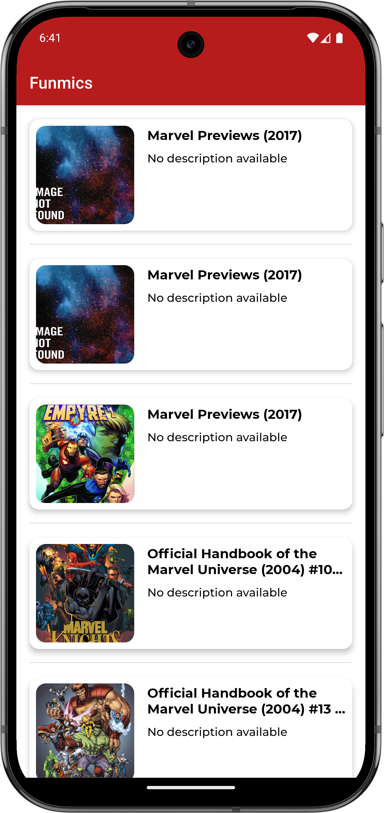

# Funmics

Funmics é um projeto desenvolvido durante um desafio técnico. Utiliza uma API da Marvel para exibir uma lista de quadrinhos.

## 🚀 Melhorias

- Arquitetura alterada de MVP para MVVM
- Reestruturação dos pacotes (camadas ui, domain e data)
- Aplicação do padrão UDF utilizando Flow
- Criação de testes unitários para ViewModel e para UseCases
- Injeção de dependência com Koin
- Uso de Interceptor para log de chamadas http
- Uso de Fragments para conteúdo da tela
- Criação do estado de lista vazia
- Melhorias de UI para modernização

## 🛠️ Tecnologias usadas

- Kotlin e Android SDK
- Retrofit
- jUnit + mockk + Turbine para testes
- Koin para DI

## 📱 Screenshots

